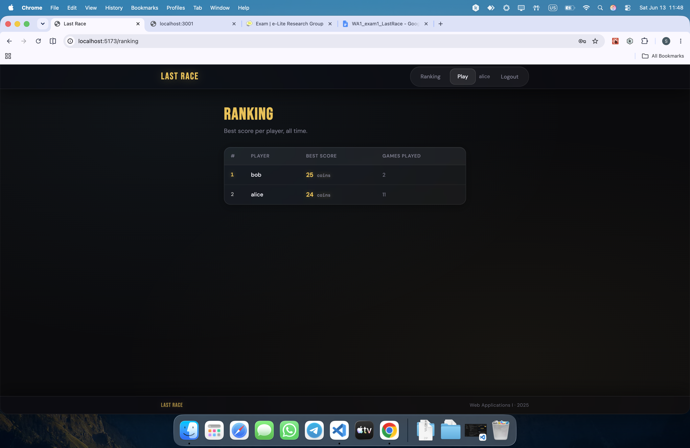
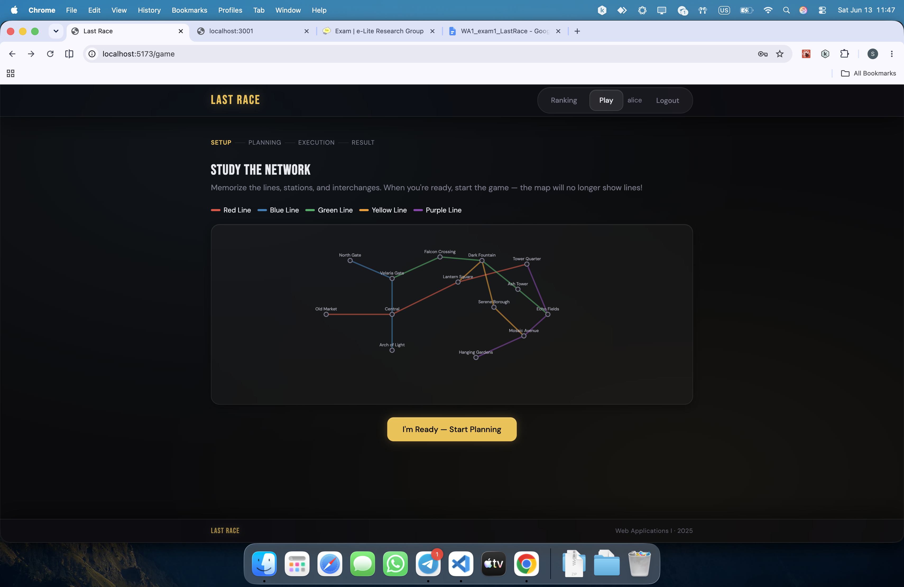
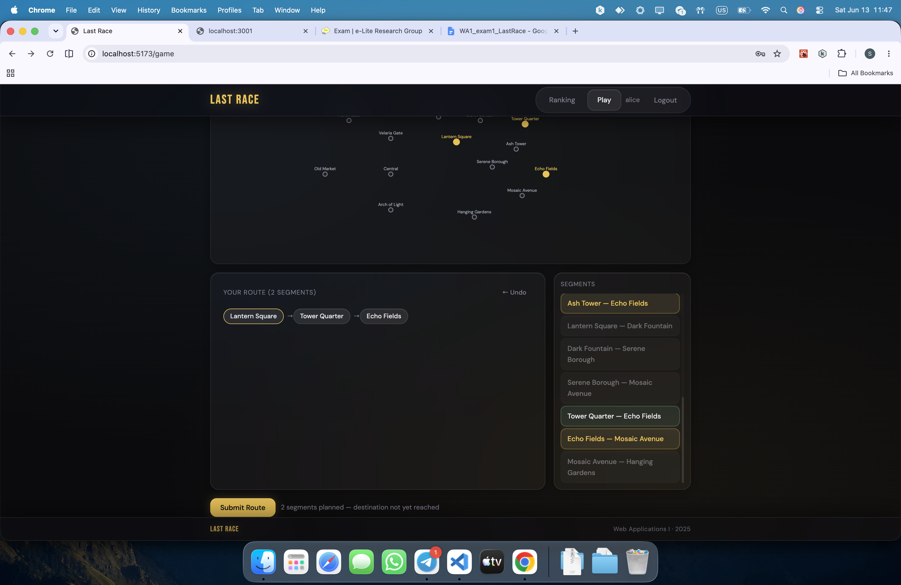
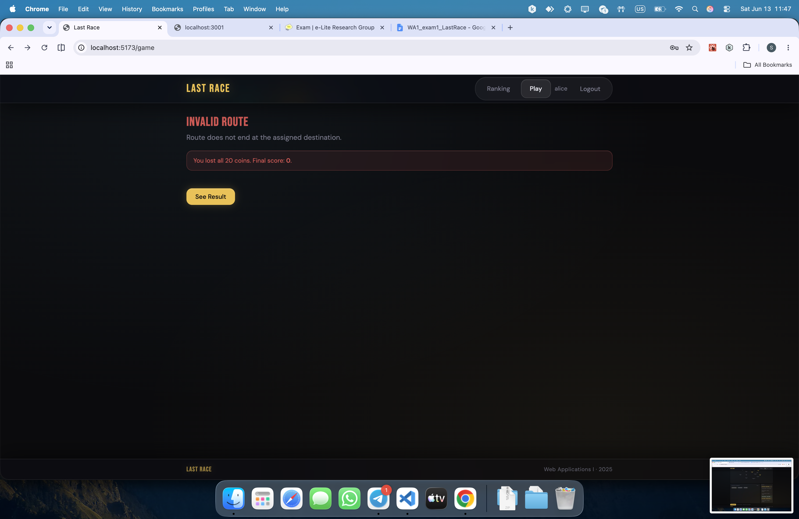
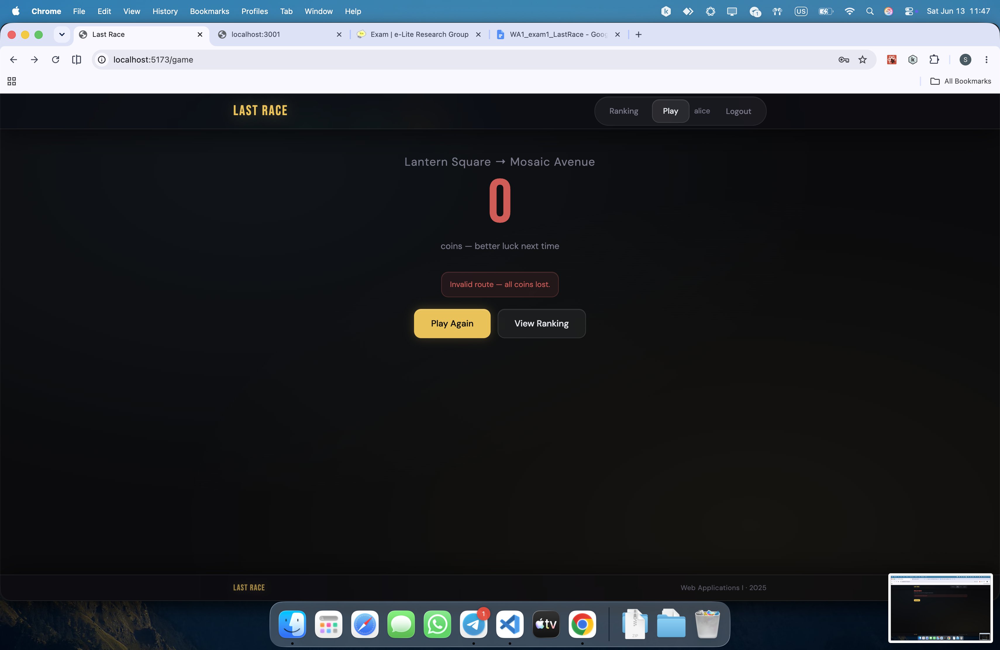

# Last Race

A single-player web game inspired by "Race the Rails". Navigate a fictional underground metro network, plan your route under time pressure, and earn the highest score.

---

## Server-side

### HTTP APIs

| Method | Endpoint | Auth | Description |
|--------|----------|------|-------------|
| `POST` | `/api/sessions` | No | Login. Body: `{ username, password }`. Returns `{ id, username }`. |
| `DELETE` | `/api/sessions/current` | Yes | Logout. Returns 204. |
| `GET` | `/api/sessions/current` | No | Returns current user `{ id, username }` or `null` if not logged in. |
| `GET` | `/api/network` | Yes | Returns full network: `{ lines, stations, segments }`. |
| `POST` | `/api/games` | Yes | Starts a new game. Returns `{ startStation, endStation }` (random pair ≥ 3 segments apart). |
| `POST` | `/api/games/submit` | Yes | Submits a route. Body: `{ route, startStationId, endStationId }`. Returns `{ valid, score, steps, reason? }`. |
| `GET` | `/api/ranking` | Yes | Returns best score per player: `[{ username, best_score, games_played }]`. |

### Database Tables

| Table | Purpose |
|-------|---------|
| `lines` | Metro lines (id, name, color hex). |
| `stations` | Metro stations (id, name). |
| `segments` | Directed connections between stations on a specific line (line_id, station_a_id, station_b_id, position). |
| `events` | Random in-game events (id, description, effect integer −4..+4). |
| `users` | Registered users (id, username, password_hash, salt). |
| `games` | Completed game records (user_id, start_station_id, end_station_id, score, completed_at). |

---

## Client-side

### React Routes

| Path | Access | Description |
|------|--------|-------------|
| `/` | Public | Home page — game instructions. Guests see instructions only; logged-in users see a "Start Game" button. |
| `/login` | Public | Login form. Redirects to `/game` on success. |
| `/game` | Protected | Full game flow: Setup → Planning → Execution → Result. |
| `/ranking` | Protected | General ranking — best score per registered user. |

### Main React Components

| Component | Location | Purpose |
|-----------|----------|---------|
| `App` | `src/App.jsx` | Root component. Sets up routing, `BrowserRouter`, and `UserProvider`. |
| `Navbar` | `src/components/Navbar.jsx` | Top navigation bar with login/logout and links. |
| `HomePage` | `src/components/HomePage.jsx` | Landing page with game instructions and call-to-action. |
| `LoginPage` | `src/components/LoginPage.jsx` | Login form with error handling. |
| `GamePage` | `src/components/GamePage.jsx` | Full game lifecycle: Setup, Planning, Execution, and Result phases. |
| `NetworkMap` | `src/components/NetworkMap.jsx` | SVG metro map. Accepts `showLines` and `highlightRoute` props. |
| `RankingPage` | `src/components/RankingPage.jsx` | Fetches and displays the all-time ranking table. |
| `UserContext` | `src/contexts/UserContext.jsx` | React context providing `user`, `login`, and `logout` to the whole app. |

---

## Screenshots

### Ranking Page

### During a Game

---

## User Credentials

| Username | Password |
|----------|----------|
| alice | password1 |
| bob | password2 |
| carol | password3 |

---

